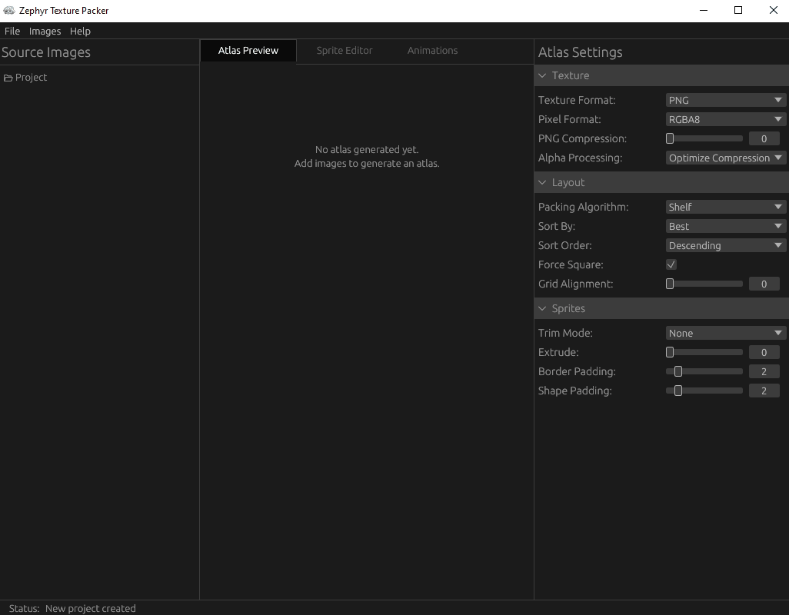
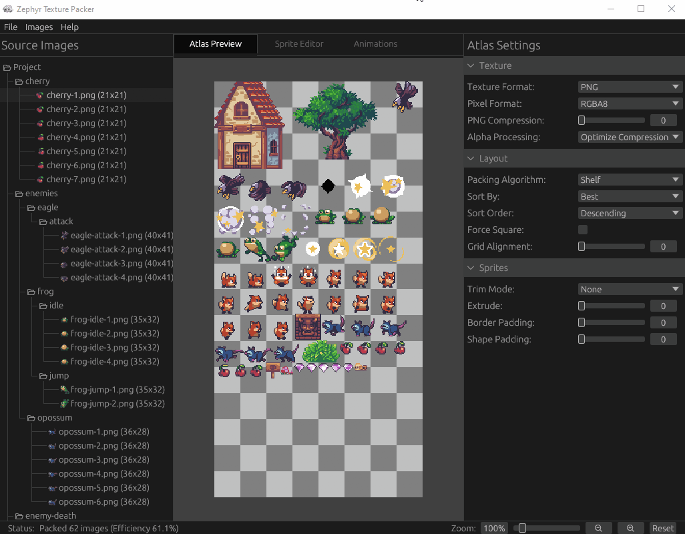

# Zephyr

**Texture packer and sprite editor with animation support for 2D games.**

Zephyr handles the full sprite workflow in a single tool: organize sprites into a tree, pack them into an atlas, create per-sprite pivot points and hitboxes, define animations, and export a packed texture alongside JSON metadata that drops straight into your game engine.

[](https://aristurtledev.itch.io/zephyr)


## Atlas Packing



Drop in your sprites and Zephyr packs them into a single texture atlas automatically. You can choose between Shelf and MaxRects packing algorithms, configure padding, and constrain the output to a maximum texture size. The packed atlas updates in real time as you make changes.

## Sprite Editor


Select any sprite in the atlas and set its pivot point by dragging the crosshair directly on the preview, or pick from a grid of presets. You can also attach hitboxes to each sprite (Rectangle, Circle, or Polygon) and adjust their shape and position with interactive handles. Polygon hitboxes support inserting and removing vertices by double-clicking edges or right-clicking points.

## Animation Editor



Build animations by dragging sprites from the tree into a frame timeline. Each frame has its own delay, and you can choose too loop the animation and the direction the animation plays in (Forward, Reverse, or PingPong). The preview plays the animation back live as you edit it.

## Download

Pre-built binaries for Windows, macOS, and Linux are available on the [Itch.io page](https://aristurtledev.itch.io/zephyr). Download the archive for your platform, extract it, and run the executable; no installation required.

## Building from Source

### Prerequisites

- Rust toolchain (stable, 2024 edition or later)

### Build

1. **Clone the repository**

   ```bash
   git clone https://github.com/AristurtleDev/zephyr.git
   cd zephyr
   ```

2. **Initialize submodules**

   ```bash
   git submodule update --init --recursive
   ```

3. **Build and run**

   ```bash
   cargo run --release
   ```

## Usage

### Getting Started

1. **Add Sprites**
   - Use `Images > Add Images...` or `Images > Add Directory...` to load sprites, or drag and drop images directly onto the window
   - Use the tree panel on the left to create directories and organize your sprites

2. **Configure the Atlas**
   - The tabs above the center panel switch between **Preview**, **Sprite Editor**, and **Animation Editor**
   - Select the **Preview** tab to see the packed atlas, and use the settings panel on the right to adjust the packing algorithm, texture format, atlas size, and padding

3. **Edit Sprites**
   - Select a sprite in the tree and switch to the **Sprite Editor** tab
   - Drag the crosshair to position the pivot point, or choose a preset from the settings panel on the right
   - Add hitboxes (Rectangle, Circle, or Polygon) and drag their handles to adjust shape and position
   - For polygon hitboxes, double-click an edge to insert a vertex or right-click a vertex to remove it

4. **Create Animations**
   - Switch to the **Animation Editor** tab and create a new animation from the settings panel on the right
   - Drag sprites from the tree into the frame timeline
   - Adjust per-frame delay and choose a playback mode, then watch it play back in the preview

5. **Export**
   - `File > Export` to write the packed atlas texture and JSON metadata to disk

### Keyboard Shortcuts

| Shortcut | Action                      |
| -------- | --------------------------- |
| `Ctrl+S` | Save project                |
| `Ctrl+O` | Open project                |
| `Ctrl+E` | Export atlas                |
| `F2`     | Rename selected node        |
| `Delete` | Delete selected node        |
| `Escape` | Cancel rename / close modal |

### Project Files and Image Paths

Projects are saved as a single `.zephyr` file. Source images are referenced by paths relative to where the project file is saved, so keep your images and project file together. Moving either one without the other will break the link.

```text
my-project.zephyr    # All metadata, animations, and pack settings in one file
sprites/             # Source images (keep alongside the project file)
```

### Exported Output

```text
atlas.png            # Packed texture (format depends on export settings)
atlas.json           # Sprite positions, pivot points, hitboxes, and animations
```

See [EXPORT-FORMAT.md](EXPORT-FORMAT.md) for a full description of the JSON schema.

## License

Zephyr source code is licensed under the MIT License. See [LICENSE](LICENSE) for the full license text.

The artwork and mascot character (images/ and src/assets/) are copyright 2026 Christopher Whitley (AristurtleDev), all rights reserved. These images may not be reused without permission. See [LICENSE-ASSETS](LICENSE-ASSETS) for details.

Third-party asset credits are listed in [CREDITS.md](CREDITS.md).
